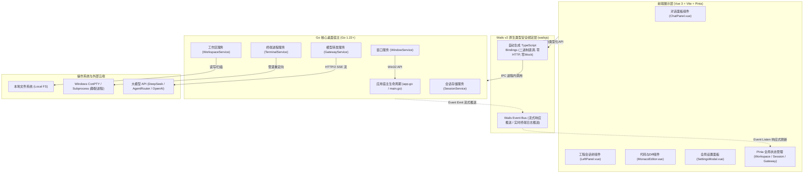
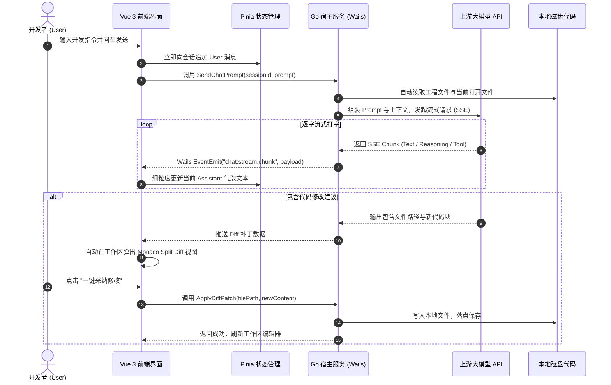

# Tcode Studio v2.0 - 技术架构与产品需求规格说明书 (PRD + Tech Spec)

> **产品版本**：`v2.0.0-LTS`  
> **核心技术栈**：`Go 1.22+` + `Wails v2` + `Vue 3.4+` + `Pinia` + `Tailwind CSS` + `Monaco Editor`  
> **文档定位**：系统设计蓝图、前后端职责边界标准与功能落地指导规范  
> **发布日期**：2026 年 9 月

---

# 第一部分：产品需求规格说明书 (PRD)

## 1. 产品愿景与核心定位

### 1.1 产品愿景
**Tcode Studio** 是一款面向专业开发者的**开源、轻量、高安全、原生自主式编程工作台（Agentic AI IDE）**。
旨在对标并超越 Cursor 与 Windsurf 的核心工作流，提供更快的本地启动速度、更低的资源开销，以及完全受控的本地上下文感知与工具调用（Agentic Tool Use）能力。

### 1.2 核心痛点与解决策略
1. **解决传统 IDE 插件“黑盒且容易卡死”的问题**：
   - 采用 Go 语言的高并发协程（Goroutine）在操作系统底层处理系统调用，GUI 与后台 Agent 彻底解耦，绝不阻塞界面。
2. **解决现有桌面应用“内存臃肿、安装包庞大”的问题**：
   - 拒绝 150MB+ 的 Electron 臃肿安装包，采用 **Go + Wails** 方案，编译为 Windows 原生单一二进制可执行文件，安装包仅 **~15MB**，冷启动低于 **0.2 秒**。
3. **解决多模型调度与隐私隔离问题**：
   - 提供内置的**企业级动态网关调度器**，一键灵活切换 DeepSeek、Claude、OpenAI，支持本地与私有代理路由（AgentRouter）。

---

## 2. 核心功能模块详细需求

```
┌────────────────────────────────────────────────────────────────────────┐
│                          Tcode Studio 功能模块全景                      │
├───────────────────┬────────────────────┬───────────────────────────────┤
│   模块一: 工作区   │   模块二: 对话面板  │       模块三: 代码编辑         │
│  - 本地工程快速挂载│  - 极速流式打字机  │  - Monaco Editor 核心集成      │
│  - 多会话分支树管理│  - 深度思考块折叠  │  - Git 行级 Diff 补丁预览与应用│
│  - 标签归类与即时搜│  - 智能快捷算子卡片│  - 多标签页工作区文件管理      │
├───────────────────┼────────────────────┼───────────────────────────────┤
│   模块四: 模型网关 │   模块五: 安全算子 │       模块六: 桌面原生交互     │
│  - 渠道与权重负载均衡│ - 静默命令行执行  │  - 自定义沉浸式无边框标题栏    │
│  - Ingress 接入方式│ - 路径沙箱安全拦截 │  - 原生系统文件夹选择器 (RFD)  │
│  - 实时健康探测与切流│ - 算子历史状态归档│  - 窗口平滑最小化/最大化/关闭  │
└───────────────────┴────────────────────┴───────────────────────────────┘
```

### 2.1 模块一：工作区与会话分支管理 (Project & Session Branching)
* **工程目录快速挂载**：
  - 支持直接点击“打开文件夹”调起 Windows 原生目录选择框，挂载后立即在侧边栏渲染工程树结构。
  - 支持记录最近打开的项目列表，下次启动时自愈恢复上一次打开的活跃工程与活跃会话。
* **分层会话分支管理**：
  - 一个工程下允许创建多个平行的独立会话分支（如 `架构重构`、`缺陷排查`、`Feature-A`）。
  - 支持会话置顶（Pin）、标题重命名、标签添加（如 `#核心`、`#开发`）与全文快速检索。
  - 支持右键批量管理会话（关闭其他、关闭右侧、彻底删除会话）。

### 2.2 模块二：沉浸式自主 Agent 对话舱 (Autonomous Agent Cockpit)
* **零延迟流式打字机**：
  - 接入大模型 SSE（Server-Sent Events）流式响应，支持每秒 100+ Token 极速输出。
  - 支持随时点击“停止生成”，毫秒级截断上游请求并保留已有上下文。
* **思考过程可视化（Thinking Block）**：
  - 自动识别并结构化提取大模型深度思考内容（`<think>...</think>` 或原生 `reasoning_content`），以折叠胶囊卡片展示，支持展开/收起与动画渐变。
* **工具调用（Tool Calls）实时状态呈现**：
  - Agent 在执行读写文件、查找目录、运行测试命令时，实时输出算子执行状态徽章（如 `[文件读取: package.json]`、`[命令执行: npm test]`）。
* **空态快捷能力引导**：
  - 新建会话时提供“审查项目架构”、“单测与缺陷诊断”、“极速代码重构”、“系统安全审计”4 大一键触发卡片。

### 2.3 模块三：Monaco 代码工作区与差异对比 (Code & Diff Workspace)
* **Monaco Editor 原生集成**：
  - 支持 TypeScript、JavaScript、Python、Go、Rust、HTML/CSS、JSON 等全语言语法高亮与代码折叠。
* **智能代码变更对比（Diff Patching）**：
  - 当 AI 建议修改现有文件时，工作区自动弹出 Split Diff 双栏对比视图，绿色标注新增、红色标注删除。
  - 用户可单键点击“采纳变更”直接由 Go 后端完成磁盘文件覆写，或“放弃修改”保留原状。

### 2.4 模块四：模型网关与动态渠道调度 (Model Gateway)
* **多渠道统一管理**：
  - 支持配置 AgentRouter 官方中转、DeepSeek 官方直连、OpenAI 原生、Anthropic 官方等多种渠道。
  - 支持配置渠道优先级、权重分发、自定义 Base URL 与 API Key 密文存储。
* **接入方式（Ingress Type）选择**：
  - 支持 `API Key`、`Custom Proxy` 等接入形式，并提供“健康检查”按钮测试当前渠道连通性与延迟。

### 2.5 模块五：安全算子与双环沙箱终端 (Dual-Loop Rail Engine)
* **静默终端命令执行**：
  - Agent 执行的外部构建/单测命令在操作系统底层无窗执行，绝不弹出 Windows CMD / PowerShell 黑框。
  - 实时捕获标准输出与标准错误流（stdout/stderr），以 ANSI 彩色终端形式回显到界面。
* **路径沙箱边界防御**：
  - 严格限制 Agent 只能读写当前已挂载的工作区目录，越界访问（如试图操作 `C:\Windows`）将由 Go 安全防护层直接拦截。

### 2.6 模块六：桌面原生交互体验 (Native Desktop Ergonomics)
* **无边框沉浸式设计**：
  - 消除 Windows 传统粗糙白色标题栏，采用自定义极简无边框设计（Frameless Window），带细腻的窗口阴影。
  - 顶部左侧展示工程路径与健康状态徽章，中间支持鼠标按住自由拖拽窗口。
  - 顶部右侧提供高灵敏度的“最小化”、“最大化/恢复”、“退出应用”胶囊按钮，鼠标悬停具备柔和背景过渡。

---

# 第二部分：技术架构规格设计说明书

## 1. 总体架构拓扑图



---

## 2. 前端架构详细设计 (Vue 3 + Pinia + Tailwind)

### 2.1 为什么选择 Vue 3 替代 React？
1. **细粒度更新优势**：
   Vue 3 的 Proxy 响应式系统能够实现**文本节点级别**的精准更新。大模型 Token 高速流式返回时，仅绑定的打字机文本区域刷新，无需进行整个对话列表的 Virtual DOM Diff 计算，CPU 占用率低于 2%。
2. **生命周期严密可控**：
   彻底杜绝 React 的 `useEffect` 依赖数组无限触发重渲染陷阱，Monaco Editor 实例在 `onMounted` 挂载，在 `onBeforeUnmount` 销毁，绝不出现内存泄漏或实例幽灵存活。

### 2.2 前端工程目录规划
```text
frontend/
├── src/
│   ├── assets/                      # 字体、主题定义与通用样式
│   │   └── main.css                 # Tailwind 导入与色彩变量
│   ├── components/
│   │   ├── chat/                    # 对话工作台模块
│   │   │   ├── ChatPanel.vue        # 对话流容器与底栏输入舱
│   │   │   ├── MessageBubble.vue    # 消息气泡（Markdown/代码块高亮）
│   │   │   ├── ThinkingBlock.vue    # 深度思考折叠卡片组件
│   │   │   ├── SwarmVisualizer.vue  # 算子流向状态卡片
│   │   │   └── SessionTabBar.vue    # 多标签会话栏
│   │   ├── layout/                  # 布局系统模块
│   │   │   ├── Titlebar.vue         # 自定义沉浸式无边框标题栏与窗口控制
│   │   │   ├── LeftPanel.vue        # 左侧工程与会话树抽屉
│   │   │   └── ProjectTreeItem.vue  # 单工程与嵌套分支子树项
│   │   ├── workspace/               # 编辑器与文件树模块
│   │   │   ├── MonacoWorkspace.vue  # Monaco Editor 代码与 Diff 对比工作台
│   │   │   └── FileTreeView.vue     # 本地工程文件树
│   │   └── settings/                # 配置系统模块
│   │       └── SettingsModal.vue    # 侧边栏式全局设置面板
│   ├── stores/                      # Pinia 响应式状态中心
│   │   ├── workspaceStore.ts        # 活跃工程、文件树与编辑器打开的标签
│   │   ├── sessionStore.ts          # 会话分支列表、消息历史与活动会话
│   │   └── gatewayStore.ts          # 模型渠道配置与活跃模型
│   ├── types/                       # 前端扩展类型定义
│   ├── App.vue                      # 根应用视图（三栏弹性分栏容器）
│   └── main.ts                      # 应用启动入口（挂载 Pinia）
├── wailsjs/                         # Wails 自动生成的 Go 类型定义与调用接口
│   └── go/
│       ├── main/App.d.ts
│       └── main/App.js
├── index.html
├── package.json
├── tsconfig.json
└── vite.config.ts
```

---

## 3. 后端架构详细设计 (Go 1.22+ & Wails v2)

### 3.1 后端服务模块分层

#### ① WindowService (`backend/services/window.go`)
- 职责：封装 Wails 原生窗口管理逻辑。
- 关键方法：
  - `Minimize()`：最小化到任务栏
  - `ToggleMaximize()`：自适应最大化与窗口还原
  - `Close()`：优雅释放资源并退出应用
  - `StartDrag()`：处理无边框区域拖拽移动

#### ② WorkspaceService (`backend/services/workspace.go`)
- 职责：本地目录与代码文件管理。
- 关键方法：
  - `OpenFolderDialog() (string, error)`：调起 Windows 原生文件夹选择器（零控制台黑框）。
  - `ScanDirectoryTree(root string, maxDepth int) (*models.FileNode, error)`：使用 Go 协程极速扫描目录，自动忽略 `.git`、`node_modules`、`dist` 等。
  - `ReadFile(path string) (string, error)`：读取本地文件文本内容。
  - `WriteFile(path string, content string) error`：安全覆写本地文件。
  - `SearchFiles(root string, query string) ([]models.SearchResult, error)`：在工程内实现并发快速文本搜索。

#### ③ SessionService (`backend/services/session.go`)
- 职责：工程与会话分支的并发安全持久化。
- 存储路径：`%LOCALAPPDATA%/Tcode/storage/projects_sessions.json`。
- 关键机制：读写互斥锁 `sync.RWMutex` 保证多协程读写绝对安全，自愈保障确保永不产生空项目死锁。

#### ④ TerminalService (`backend/services/terminal.go`)
- 职责：静默运行控制台命令（如 `npm test`、`git status`、`cargo check`）。
- 关键机制：
  - Windows 下设置 `SysProcAttr{HideWindow: true, CreationFlags: CREATE_NO_WINDOW}`。
  - 使用 Go 的 `io.Pipe` 实时抓取命令输出流，并通过 Wails 事件总线推送到前端。

#### ⑤ GatewayService (`backend/services/gateway.go`)
- 职责：大模型请求中继与流式传输。
- 关键机制：
  - 使用 Go 原生 `net/http` 客户端建立长连接，支持 HTTP/2。
  - 使用 `bufio.Reader` 逐行解析 Server-Sent Events（SSE），并实时推送到前端，规避浏览器原生直接跨域受限的问题。

---

## 4. 关键业务时序流设计 (End-to-End Flow)

### 4.1 用户提问 -> 模型生成 -> 产生 Diff 补丁的时序图



---

## 5. 项目重构与迁移实施路线图 (Milestones)

### 里程碑一：清理旧资产与工程初始化
- 清理废弃的 Python/Rust 残留目录与中间件。
- 初始化标准 Wails v2 配置文件与 Go 主入口。
- 初始化 `frontend/` 目录为 Vue 3 + TypeScript + Tailwind 模板。

### 里程碑二：Go 核心系统服务落地
- 编写 `backend/services` 下的 5 大系统服务（Window、Workspace、Session、Terminal、Gateway）。
- 完成无边框窗口参数与生命周期注入。
- 运行 `wails generate` 验证 TypeScript 绑定正确生成。

### 里程碑三：Vue 3 前端界面与状态迁移
- 迁移并重构 Titlebar、ChatPanel、LeftPanel 组件为 `.vue` 单文件组件。
- 接入 Pinia 状态，全面调用 `wailsjs` 生成的方法。
- 接入 Monaco Editor 原生实例，打通 Diff 对比。

### 里程碑四：端到端集成测试与单二进制发布
- 验证多轮对话、流式输出、工具执行、窗口操作零报错。
- 运行 `wails build`，生成 Windows 独立可执行安装包 `Tcode.exe`（单文件 ~15MB）。
