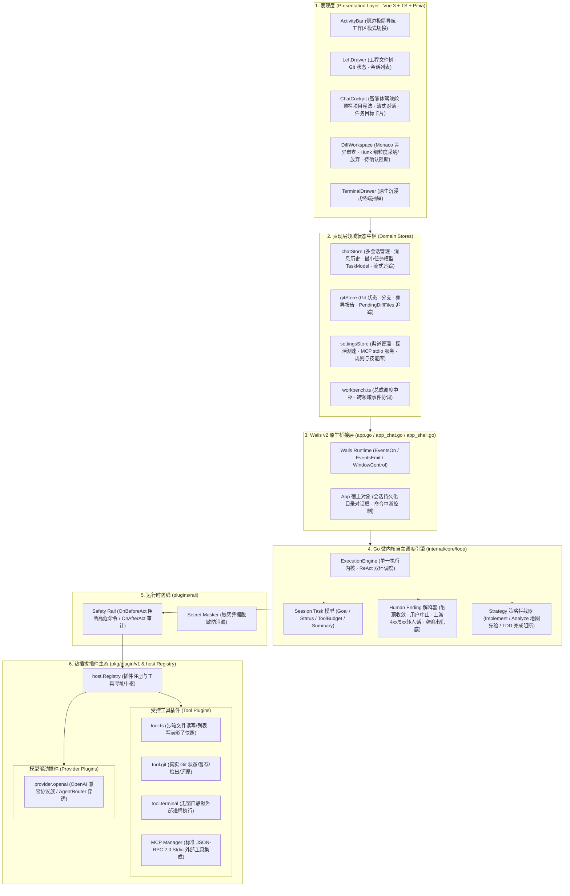
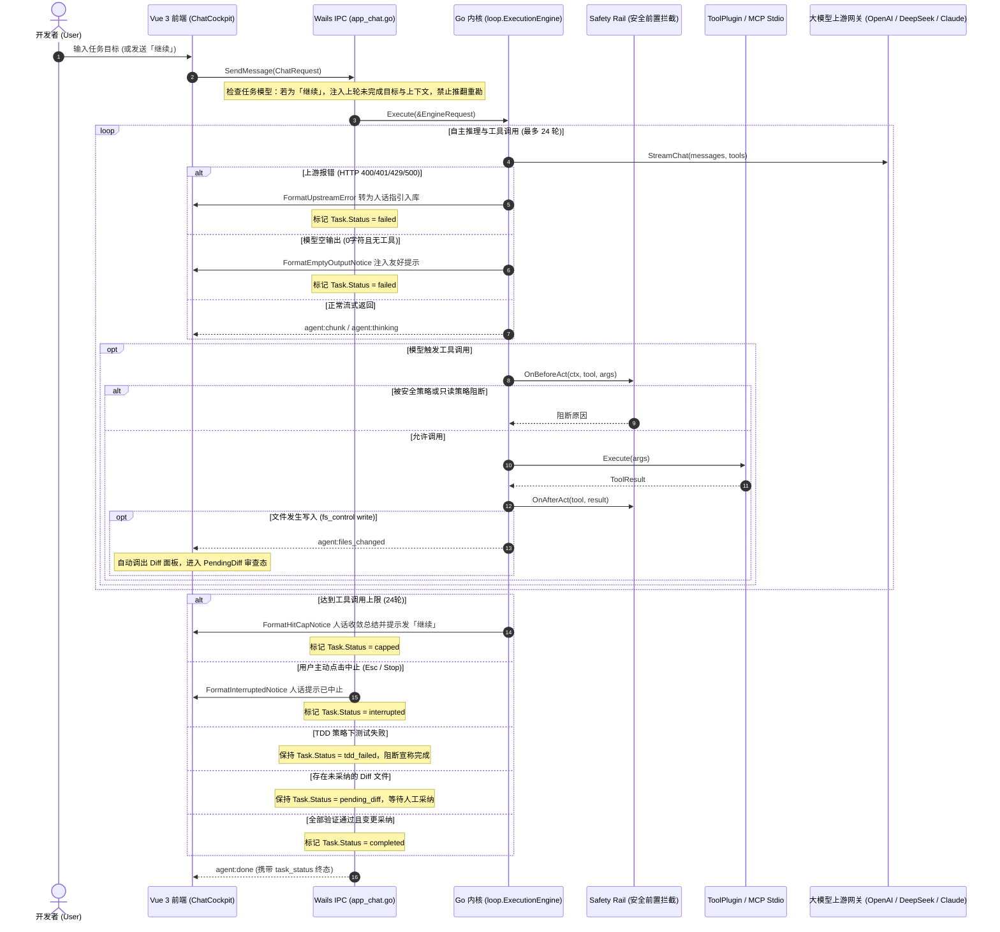

# 湉码 / tiancode 现行架构设计规范 (ARCHITECTURE.md)

> **现行唯一发货技术栈**：**Wails v2 + Go 微内核 + Vue 3 / Vite + TypeScript + Pinia**  
> ⚠️ **历史架构作废与归档声明**：所有涉及 Tauri v2 / Rust Core / React 19 / Python Daemon / HTML 原型的材料已全部归档至 `archive/` 目录，明确标记为历史探索产物，**严禁作为主路径代码或发货基准**。

---

## 🏛️ 一、现行分层解耦微内核全景图 (Current Microkernel Topology)

---

## 🔄 二、单一执行内核与任务生命周期流转 (Execution Flow & Task Lifecycle)

---

## 📐 三、核心架构设计与工程约束

### 1. 一条执行内核 (Single Execution Engine)
- 废除任何两套执行循环。所有大模型推理统一收敛至 `internal/core/loop/llm_path.go` 驱动的直接执行循环；
- 统一工具调用轮次上限为 24 轮，统一错误捕获、统一取消处理、统一事件管道派发。

### 2. Session 最小任务模型 (TaskModel)
- 每个会话实体 `session.ChatSession` 均强类型挂载 `TaskModel`：
  - `Goal`：用户原始目标（或提炼目标）；
  - `Status`：`idle` | `running` | `completed` | `capped` | `interrupted` | `failed` | `pending_diff` | `tdd_failed`；
  - `ToolBudget` / `ToolsUsed`：工具配额与已用次数计数器；
  - `Summary`：当前阶段探明成果与未完成项摘要；
  - `PendingDiffFiles`：智能体已修改但尚未经人工点击采纳的文件列表。
- **「继续」语义接续**：当用户输入「继续」时，底层自动唤醒未完成任务模型，注入接续提示词，绝对不重新扫描全局目录结构。

### 3. 审查类任务先地图再下钻规约 (Map-First Strategy)
- 在 `StrategyAnalyze`（及所有代码审查任务）中注入硬性约束：
  - **第一步（看地图）**：先读取项目顶层结构与关键配置文件（`go.mod`、`package.json`、`Cargo.toml`、`README.md`）；
  - **第二步（定靶向）**：定位核心模块入口与调用拓扑；
  - **第三步（精准下钻）**：仅读取靶向具体文件，严禁全库盲目递归扫描。

### 4. 人话收尾系统 (Human-Readable Endings)
- 严禁用户面对「突然没了」或空白气泡：
  - **触顶 (Capped)**：输出友好阶段性成果说明并提示发送「继续」；
  - **取消 (Interrupted)**：输出中止说明并保存已生成内容与上下文；
  - **上游错误 (HTTP 4xx/5xx)**：解析网络与协议错误，以人话指出原因（上下文超长/鉴权失败/限流/服务挂死）及解决建议；
  - **空回复 (Empty)**：输出空响应防御提示，指导重新提问或更换模型。

### 5. 文件变更 Diff 确认闭环
- 工具写入文件后，自动派发 `agent:files_changed`；
- 前端自动打开 Monaco Diff 工作区，展示行级差异与变更块（Hunk）；
- 用户点击「✓ 采纳变更」（`git add / stage`）或「✕ 放弃修改」（`git checkout`）后，任务才进入下一阶段或终态。

### 6. 项目宪法顶栏显式可见
- 将当前工作区生效的 Rules 规约与 Skills 技能库统计在对话顶栏（`📜 项目宪法`）；
- 开发者可随时展开抽屉/弹层，核对当前全流程注入大模型上下文的完整条文。

### 7. MCP 传输规范
- 微内核与 UI 仅承诺并实现标准 JSON-RPC 2.0 `stdio` 通信；
- 拒绝任何未实现的 SSE 伪宣传，确保工业级生产稳定性。
