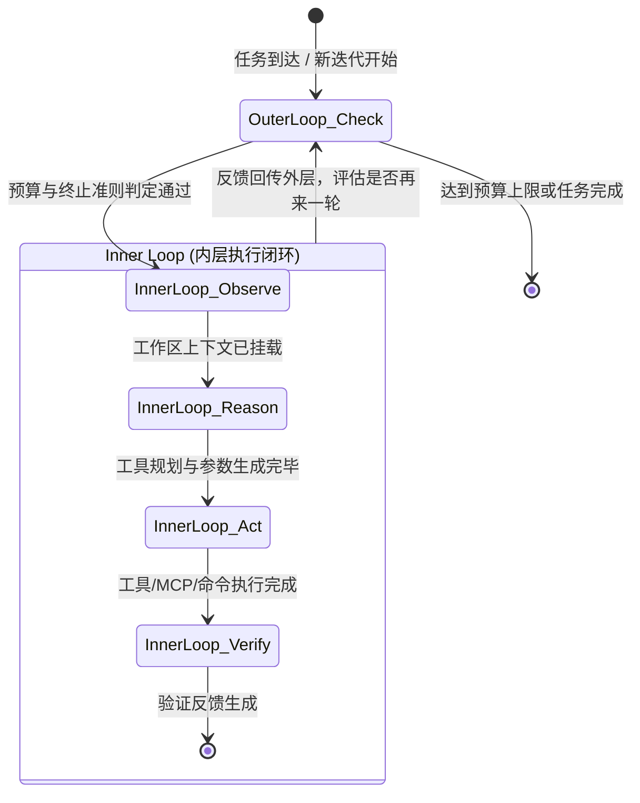

# 📐 Tcode SwarmFlow 与统一执行内核架构规范说明书 (PRD)

> **文档状态**：⚠️ **【非发货规格 / 远期探索材料】**（日期：2026-08-29 / P2 暂缓项）  
> **现行发货标准**：以 [`docs/ARCHITECTURE.md`](./ARCHITECTURE.md) 与 `frontend/src`、`app.go` 为唯一准则。主旅程稳定前不引入复杂 Swarm 空算子。  
> **版本**：v2.1.0 (远期规划稿)

---

## 1. 架构愿景与设计哲学

在现代复杂 AI 代码协同场景中，单体硬编码调度逻辑无法同时兼顾轻量单智能体与大规模多智能体团队。Tcode 提出三大核心设计准则：
1. **同一套执行内核 (Unified Execution Engine)**：不论是独立工作的单个 Agent、被委派处理子任务的 Agent，还是 Swarm 团队的一员，底层均运行同一套统一双环执行内核。
2. **能力即插件 (Capabilities as Rails)**：安全策略、记忆检索、任务规划、工具治理、人机交互等能力以 “Rail” 的形式挂载在执行生命周期的固定钩子上，通过优先级决定拦截顺序与覆盖权限。
3. **编排即算子 (Orchestration as Operators)**：多智能体协作不是一套僵化死板的拓扑，而是一组像函数式算子一样的 `budget()`, `parallel()`, `compact()`, `pipeline()`, `agent_session()`, `human()`, `return`，支持自由重排与拼装。

---

## 2. 统一双环执行内核 (Inner Loop / Outer Loop)

### 2.1 Inner Loop (内层执行闭环)
- **Observe (观察)**：收集当前项目文件上下文、Git 变更、诊断信息（LSP / Compiler）与用户最新输入；
- **Reason (推理)**：调用大语言模型进行思维链（CoT）推理、规划子任务并生成工具调用指令；
- **Act (行动)**：安全分发并执行工具（本地文件读写、PowerShell 命令、MCP Server 工具调用）；
- **Verify (验证)**：对执行产物进行自动化编译、测试或语法检查，产出结构化验证结论（Passed / Failed / Error）。

### 2.2 Outer Loop (外层迭代收敛)
- 负责控制迭代的生命周期边界；
- 根据 Inner Loop 的 `Verify` 结果、任务目标契约及剩余预算，判断：
  - 是否已达成既定目标？→ 触发收口退出；
  - 是否验证失败且允许自我修复（Self-Healing）？→ 触发下一轮 Inner Loop；
  - 是否达到最大尝试轮次或预算耗尽？→ 终止并输出诊断。

---

## 3. Rail 钩子机制 (能力即插件)

执行生命周期预留标准钩子，任何 Rail 只需实现对应的处理器接口：

| 钩子名称 | 触发时机 | 典型挂载 Rail 与职责 |
| :--- | :--- | :--- |
| `on_before_observe` | 观察前触发 | 注入动态环境变量、检查凭据合法性 |
| `on_after_observe` | 观察后触发 | `MemoryRail`（排序注入语义检索与 RepoMap） |
| `on_before_reason` | 推理前触发 | 组装 System Prompt 与上下文窗口截断保护 |
| `on_after_reason` | 推理后触发 | 提取思考流（Thinking Chunk）与工具调用意图 |
| `on_before_act` | 执行工具前 | `SafetyRail`（高危命令拦截、路径越界检查、双环沙箱阻断） |
| `on_after_act` | 工具执行后 | 日志审计记录、性能与耗时统计 |
| `on_before_verify` | 验证前触发 | 准备测试环境或测试治具（Harness） |
| `on_after_verify` | 验证完成后 | 评分与收敛判定 |
| `on_outer_loop_check` | 外层每轮判定 | 预算核销、超限终止 |

每个 Rail 拥有独立的 `priority: u32`（数值越大优先级越高），例如：
- `SafetyRail`: Priority 100（最高优先级，直接拦截危险行为）
- `MemoryRail`: Priority 80
- `ToolRail`: Priority 60
- `PlanningRail`: Priority 40
- `ObservabilityRail`: Priority 20

---

## 4. Swarm Flow 算子化多智能体编排

### 4.1 核心算子定义
1. **`budget()`**：
   - 检查当前会话与团队的剩余 Token / 资金预算与并发配额；
   - 根据预算自适应决定后续工作节点的扇出系数（Fan-out $N$）。
2. **`parallel()` (Launch Barrier Synchronization)**：
   - 并发拉起 $N$ 个独立的候选 Worker（如 Worker A 生成重构方案 1，Worker B 生成方案 2，Worker C 生成方案 3）；
   - 执行栅栏同步（Barrier Synchronization），等待所有分支全量就绪。
3. **`compact()` (Filter Empty Results)**：
   - 剔除超时、异常或空产出分支，仅保留健康有效的候选集。
4. **`pipeline()` (Streaming Review)**：
   - 将有效候选流式传递给审查流水线（Reviewer），各分支独立评审打分，流水线无需等待全局阻塞。
5. **`agent_session()` (Stateful Arbiter)**：
   - 维护持久化多轮上下文的有状态仲裁者智能体，汇聚所有候选方案与评审打分，裁决最优候选方案。
6. **`human()` (Human Fallback)**：
   - 当仲裁者置信度不足（Confidence < 80%）或命中高风险改动时，主动挂起并请求人工介入决策；
7. **`return` (Final Result)**：
   - 输出最终确认的高可靠度候选产物，完成任务交付。

---

## 5. 验收标准与测试矩阵
1. 单 Agent 与 Swarm Flow 共享底层 `AgentLoop` 内核，代码重合度 $\ge 90\%$；
2. 新增自定义 Rail 无需修改 `loop_engine.rs` 源码即可生效；
3. `SwarmFlow` 全流程流转可在前端可视化卡片中无缝呈现，包含各节点执行状态与决策分支。
